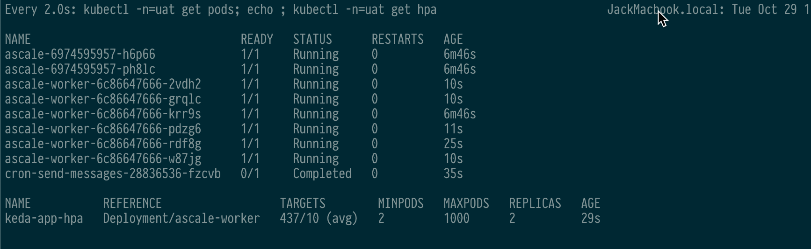
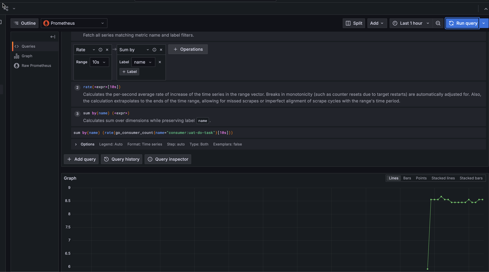
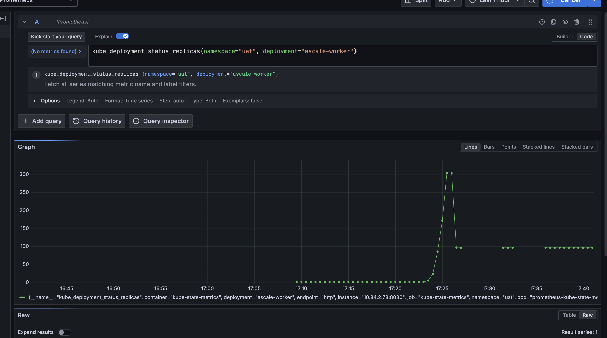

# Auto Scale Sevice


## Deploy Steps

### Install gcloud CLI 

* [Install the gcloud CLI](https://cloud.google.com/sdk/docs/install)
* `gcloud init`
* `gcloud auth application-default login`
* `gcloud components install kubectl`

### Provision Environment
```
terraform int 
terraform apply
```

### Config kubectl

```
gcloud container clusters get-credentials ascale-439911-gke --region asia-east2 --project ascale-439911
```

### Install Helm

[Install Helm3 ](https://helm.sh/docs/intro/install/)


### Build docker images and push to repository

* Go to source top directory

* Build & push
```
docker build -t gcr.io/ascale-439911/ascale-worker  ./ -f DockerfileWorker && docker push gcr.io/ascale-439911/ascale-worker && docker build -t gcr.io/ascale-439911/ascale  ./ -f Dockerfile && docker push gcr.io/ascale-439911/ascale
```
### Deply to GKE
* Crate Namespace `kubectl create ns uat`
* Add configmaps `kubectl -n=uat create configmap acesoconf --from-file=./config.toml`
* Add Gcloud Credentials `kubectl -n=uat create secret generic pubsub-key --from-file=key.json`
* Deploy App `helm -n=uat install ascale ./k8s`

### HPA Autoscale

 Install Keda 
```
cd 3rd/keda
helm repo add kedacore https://kedacore.github.io/charts
helm repo update
helm install keda kedacore/keda --namespace keda --create-namespace
kubectl -n=uat create -f pubsub-scale.yaml
```


### Install Prometheus & Grafana
```
cd 3rd/prometheus
kubectl create ns monitoring
helm upgrade -i prometheus prometheus-community/kube-prometheus-stack --namespace monitoring --values kube-prometheus-stack.values
kubectl -n=monitoring port-forward service/prometheus-grafana 8999:80
kubectl -n=monitoring get secret prometheus-grafana -o jsonpath="{.data.admin-password}" | base64 --decode ; echo
```

#### QPS


#### REPLICAS

